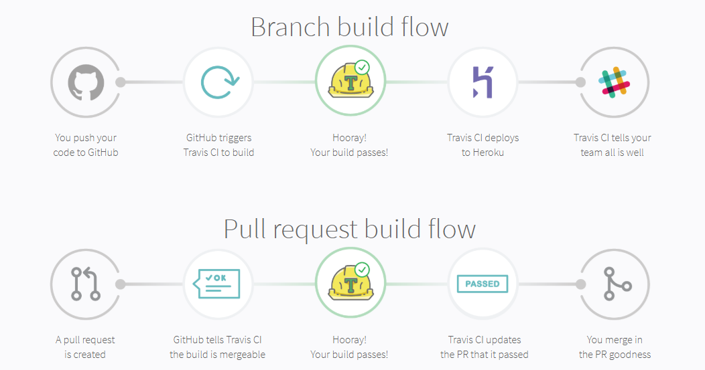

# Travis Python example unitest

1. Create project and write sample test case 
2. Create account in https://travis-ci.org
3. Create new file .travis.yml to using Travis
    - Read https://docs.travis-ci.com/user/languages to learn how to use Hound with program language

